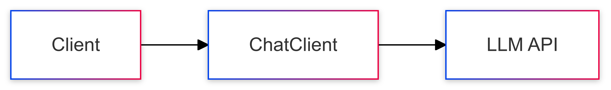

# 01-simple-prompt

The most basic form of LLM interaction. Demonstrates direct prompting without any additional context or processing.

## Key Concepts
- Basic prompt construction
- Direct LLM querying
- Simple response handling

## Example Usage
```java
String response = chatClient.prompt("What is Spring Boot?")
                            .call()
                            .content();
```

## Sequence Diagram
