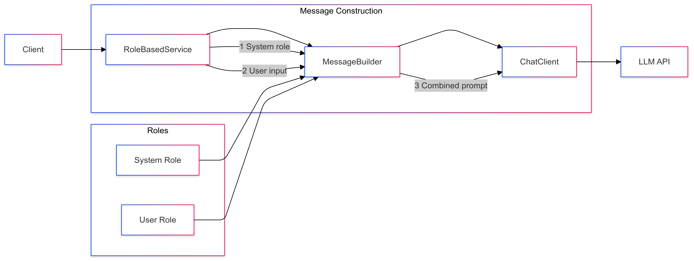

# 03-prompt-with-ai-role

Introduces role-based prompting using system and user messages.

## Key Concepts
- System messages
- User messages
- Role-based interactions
- Persona definition

## Example Usage
```java
var messages = List.of(
    new SystemMessage("You are a Java expert."),
    new UserMessage(question)
);
String response = chatClient.prompt(new Prompt(messages));
```

## Sequence Diagram
