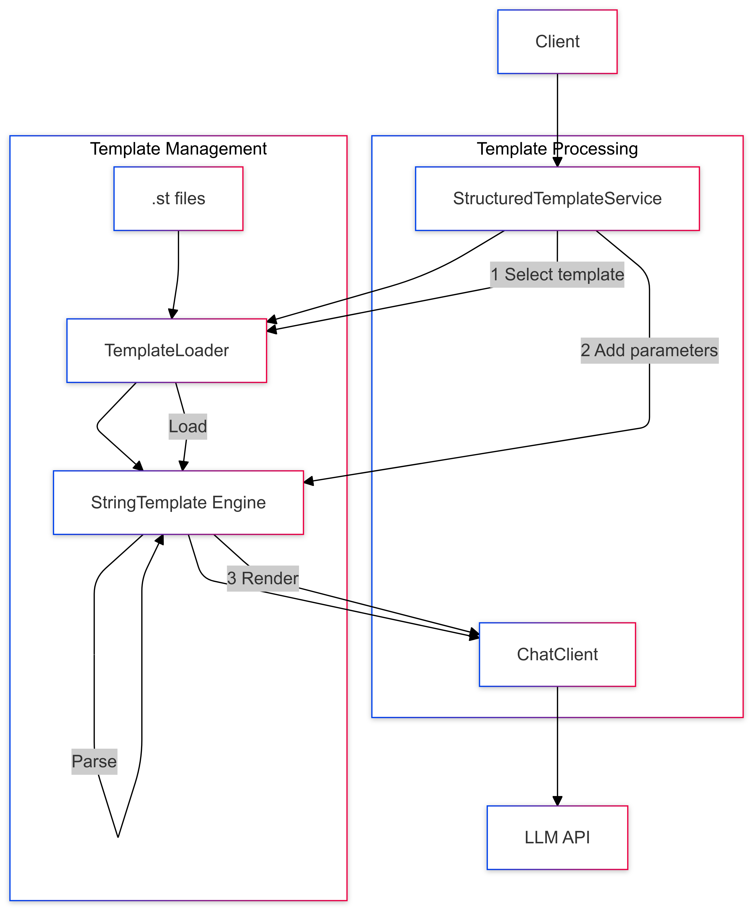

# 04-prompt-with-structured-template

Uses external template files for more complex and maintainable prompt structures.

## Key Concepts
- StringTemplate (.st) files
- Template loading
- Parameter mapping
- Reusable templates

## Example Usage
```java
var template = loadTemplate("prompts/code-review.st");
template.add("code", sourceCode);
String response = chatClient.prompt(new Prompt(template.render()));
```

## Sequence Diagram
