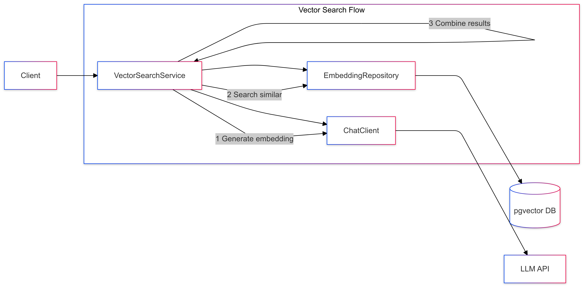

# 05-prompt-with-context-retrieval

Introduces vector search for finding relevant context before prompting.

## Key Concepts
- Vector embeddings
- Similarity search
- Context integration
- pgVector usage

## Example Usage
```java
List<String> relevantDocs = vectorSearch.findSimilar(question, 2);
String prompt = formatPrompt(question, relevantDocs);
String response = chatClient.prompt(prompt);
```

## Sequence Diagram
