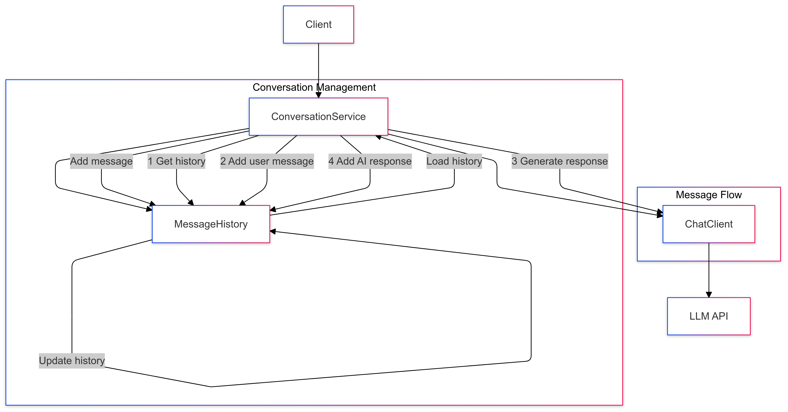

# 06-prompt-with-conversation-history

Maintains conversation context across multiple interactions.

## Key Concepts
- Message history
- Conversation state
- Context window management
- Memory handling

## Example Usage
```java
messageHistory.add(new UserMessage(userInput));
var prompt = new Prompt(messageHistory.getMessages());
String response = chatClient.generate(prompt);
messageHistory.add(new AssistantMessage(response));
```

## Sequence Diagram
