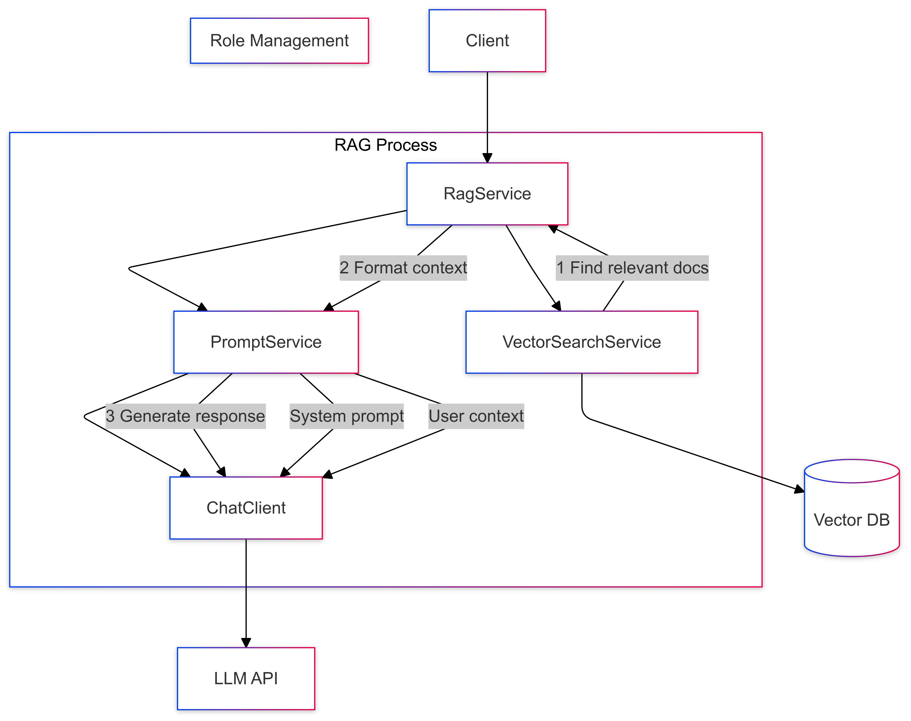

# 07-prompt-with-rag-and-roles

Combines RAG (Retrieval Augmented Generation) with role-based prompting.

## Key Concepts
- RAG architecture
- Role-based prompting
- Context integration
- Structured responses

## Example Usage
```java
List<String> relevantDocs = vectorSearch.findSimilar(question, 2);
var messages = List.of(
    new SystemMessage("Answer using only the provided context."),
    new UserMessage(formatContext(relevantDocs, question))
);
String response = aiClient.generate(new Prompt(messages));
```

## Sequence Diagram
