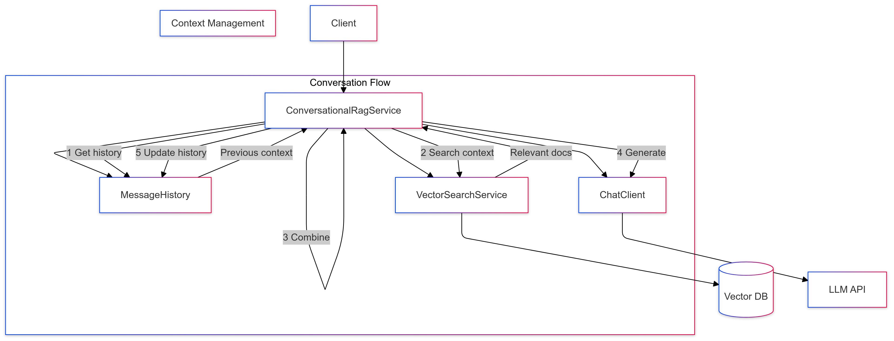

# 08-prompt-with-rag-and-conversation

Combines RAG with conversation history for contextual information retrieval.

## Key Concepts
- Conversational RAG
- Dynamic context retrieval
- Memory management
- Multi-turn interactions

## Example Usage
```java
List<String> relevantDocs = vectorSearch.findSimilar(question, 2);
messageHistory.add(new UserMessage(question));
messageHistory.add(new SystemMessage(formatContext(relevantDocs)));
var prompt = new Prompt(messageHistory.getMessages());
String response = aiClient.generate(prompt);
messageHistory.add(new AssistantMessage(response));
```

## Sequence Diagram
