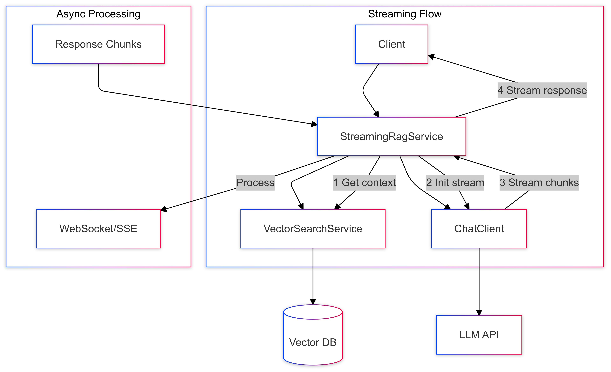

# 10-prompt-with-streaming-rag

Implements streaming responses with RAG for real-time content generation.

## Key Concepts
- Streaming responses
- Async processing
- Real-time RAG
- Response chunking

## Example Usage
```java
var relevantDocs = vectorSearch.findSimilar(question, 2);
var messages = List.of(
    new SystemMessage("Answer using only the context."),
    new UserMessage(formatContext(relevantDocs, question))
);
return chatClient.prompt(new Prompt(messages))
                 .stream()
                 .content();
```

## Sequence Diagram
